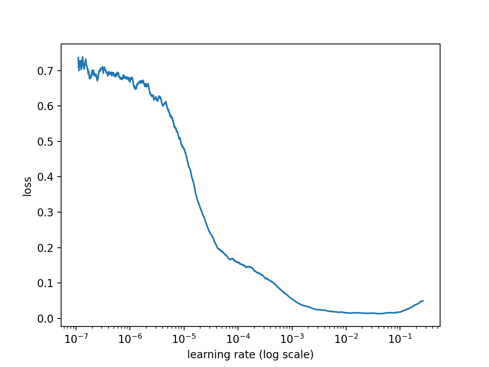
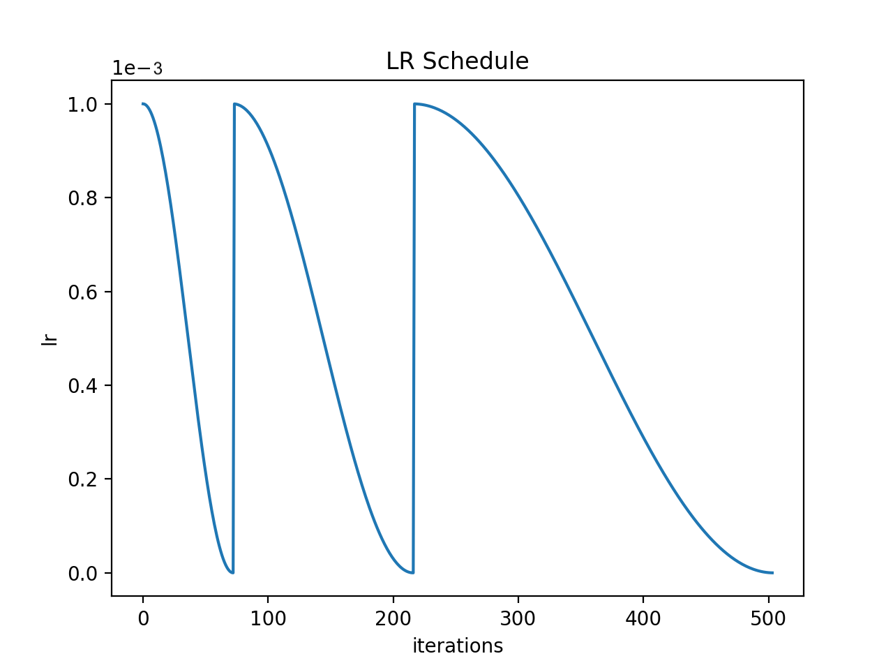

# Ktrain BioBert_NER

This repository contains data and BioBert based NER model `monologg/biobert_v1.1_pubmed` from [community-uploaded Hugging Face models](https://huggingface.co/models) for detecting entities such as chemical and disease.

## Setting up an environment

1.  [Follow the installation instructions for Conda](https://conda.io/projects/conda/en/latest/user-guide/install/index.html?highlight=conda#regular-installation).
2. Create a Conda environment called "Ktrain_NER" with Python 3.7.0:

    ```bash
    conda create -n Ktrain_NER python=3.7.0
    ```

3. Activate the Conda environment:

    ```bash
    conda activate Ktrain_NER
    ```

## Installation

Install required packages .

```sh
$ pip install tensorflow==2.1.0
```

```sh
$ pip install pytorch==1.4.0
```

```sh
$ pip install ktrain==0.12.0
```

If you want to convert your IOB schemed data to BILOU schemed using `iobToBilou.py` in utilities folder, install [spaCy](https://github.com/explosion/spaCy) using bellow command .

```sh
$ conda install -c conda-forge spacy
```

## Dataset

Download dataset provided in data folder(BC5CDR-IOB), locate it in any directory you want and address `TRAIN_DATA` and `VALIDATION_DATA` in `parameters.py` .
Use `train-dev.tsv` for training and `test.tsv` for validation.
> Ktrain can use both `validation` and `train` datas or just `train`.

## Learning rate hyper-parameter

`lr_find()` records loss over range of LRs .

```bash
def lr_find(self, start_lr=1e-7, lr_mult=1.01, max_epochs=None, 
                stop_factor=4, show_plot=False, verbose=1):

"""
Args:
            start_lr (float): smallest lr to start simulation
            lr_mult (float): multiplication factor to increase LR.
                             Ignored if max_epochs is supplied.
            max_epochs (int):  maximum number of epochs to simulate.
                               lr_mult is ignored if max_epoch is supplied.
                               Default is None. Set max_epochs to an integer
                               (e.g., 5) if lr_find is taking too long
                               and running for more epochs than desired.
            stop_factor(int): factor used to determine threhsold that loss 
                              must exceed to stop training simulation.
                              Increase this if loss is erratic and lr_find
                              exits too early.
            show_plot (bool):  If True, automatically invoke lr_plot
            verbose (bool): specifies how much output to print
        Returns:
            float:  Numerical estimate of best lr.  
                    The lr_plot method should be invoked to
                    identify the maximal loss associated with falling loss.
"""
```

For using `lr_find()` we need to a `learner` object; that we can construct it using `ktrain.get_learner()` function by passing model and data .

```bash
learner = ktrain.get_learner(model, train_data=trn, val_data=val, batch_size=128, eval_batch_size=64)
```

After trying some LRs(1e-5, 1e-4, 5e-3, 8e-4) we found that in our case optimal lr is approximately 1e-3 .



## Train and validate model

Use `python run_ner.py` to train and validate model.

## Result

We got the best result using SGDR learning rate scheduler on `BC5CDR-IOB` with `lr=1e-3`,`n_cycles=3`, `cycle_len=1` and `cycle_mult=2`. weights are availabel in `weights` folder.

```bash
learner.fit(1e-3, 3, cycle_len=1, cycle_mult=2, checkpoint_folder='/checkpoints/SGDR', early_stopping=3)
```



| | precision  | recall  | f1-score  | support  |
|---|---|---|---|---|
|  Chemical | 0.91  | 091  |  0.91 |5385
| Disease  |  0.75 | 0.81  |  0.78 |4424
| micro avg  | 0.83  | 0.87  | 0.85  |9809
| macro avg  |  0.84 | 0.87  | 0.85  |9809

## Result using fastText

We used `crawl-300d-2M-subword` from [fastext pre-trained word vectors](https://fasttext.cc/docs/en/english-vectors.html) instead of randomly initialized word embeddings with the same parameters and data as before .

| | precision  | recall  | f1-score  | support  |
|---|---|---|---|---|
|  Disease | 0.76  | 0.79  |  0.77 |4424
|  Chemical |  0.91 | 0.89  |  0.90 |5385
| micro avg  | 0.84  | 0.85  | 0.84  |9809
| macro avg  |  0.84 | 0.85  | 0.85  |9809

## Result using fastText and BILOU schemed data

In this expriment we used `BC5CDR-BILOU` _ BILOU schemed data set instead of IOB with `crawl-300d-2M-subword`(fastText word vector) and same parameters as before .

| | precision  | recall  | f1-score  | support  |
|---|---|---|---|---|
|  Chemical | 0.91  | 0.74  |  0.82 |5374
|  Disease |  0.74 | 0.72  |  0.73 |4397
| micro avg  | 0.83  | 0.73  | 0.78  |9771
| macro avg  |  0.83 | 0.73  | 0.78  |9771

## Refernces

1. [Tunning Learning Rates](https://nbviewer.jupyter.org/github/amaiya/ktrain/blob/master/tutorials/tutorial-02-tuning-learning-rates.ipynb)

2. [English NER example notebook](https://nbviewer.jupyter.org/github/amaiya/ktrain/blob/develop/examples/text/CoNLL2003-BiLSTM.ipynb)

3. [Text Sequence Tagging for Named Entity Recognition](https://nbviewer.jupyter.org/github/amaiya/ktrain/blob/master/tutorials/tutorial-06-sequence-tagging.ipynb)

4. [A Newbie’s Guide to Stochastic Gradient Descent With Restarts](https://towardsdatascience.com/https-medium-com-reina-wang-tw-stochastic-gradient-descent-with-restarts-5f511975163)

5. [Exploring Stochastic Gradient Descent with Restarts (SGDR)](https://medium.com/38th-street-studios/exploring-stochastic-gradient-descent-with-restarts-sgdr-fa206c38a74e)
